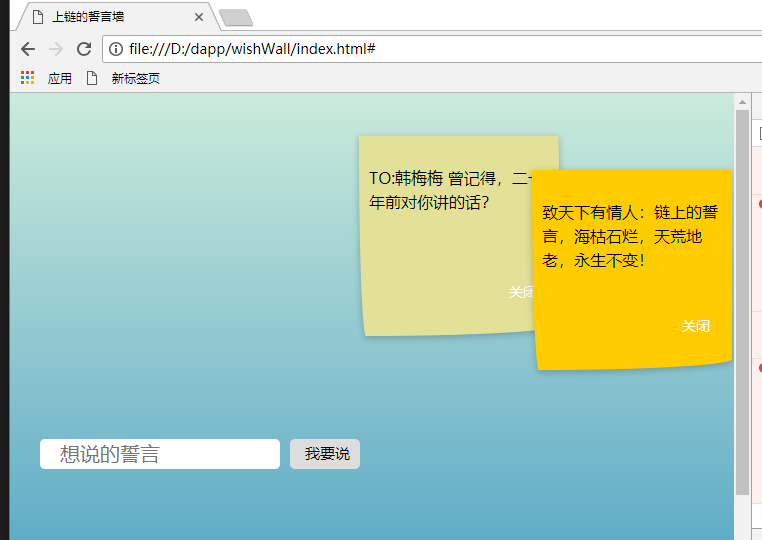

#  MOAC誓言墙
MOAC誓言墙是基于MOAC+前端Jquery实现的上链的誓言墙，誓言的特性是需要永久保存，而上链了之后永远都不会改变，链上的誓言，海枯石烂，天荒地老，永生不变 ，把誓言墙上链是非常有意义的事情，本例子虽然是简单的基础的例子，各大开发者可以在其基础上改造某某学校的誓言墙，表白墙，把单身狗的爱表达出来（要注意哦，过来人告诫：上链就删除不了。当然删除不了也没有关系，留着自己回味青春的记忆，当真正过了二十年后，你会发现当年的刻苦铭心的爱恋一点影子都没有，日记本、相册都早已经不存在，回味时如水中捞月，记得二十年同学聚会，让所有同学都有感觉的东西就是一个同学保存了另一个同学二十年前的情书），还可以实现毕业的班级留言本等。

## Getting started
- 下载当前项目，只要浏览器即可

  
 - git中直接查看玩一玩（当前的moac只能玩几十次）： http://htmlpreview.github.com/?https://github.com/moacDapp/oathWall/blob/master/index.html

 - 到Moac公链中查看：http://explorer.moac.io/addr/0x07b18a20c025674bd30edce6fe055d7d5a55f370
## 上链设置
本示例的上链使用了火花链的API接口进行上链操作，使用火花链的API接口的简单方便，火花链的API接口目前分两个层面
- 钱包层面  <a href="https://github.com/sparkChainBaas/wechatMsg">微信留言板</a> 给出一个官方的实现
- 账户层面  直接使用账户，通过简单的选链就可以在不同的链上切换，本实例使用了MOAC

本示例中的上链就是一个标准的文本上链，把数据文本保存到公链上去，对于小型的应用而言，一些简单的内容根本就不保存在数据库，只需要保存在公链上，当然需要GAS费用，MOAC目前还比较便宜，0.1分钱左右。
文本上链的做法也比较简单，就是交易过程上链，一个账户向别外一个账户转带备注的账即可

- 创建两个账户
 通过 https://dapi.sparkchain.cn/v1/account/creatAccount?chainCode=moac 来创建两个账户
 修改chain.js中两个钱包地址
 ```
 var moacTestSrcAddr = "0x32d012e43fdc978260cee98f5f6899a6cb18a148";
 var moacTestSrcSecret = "dc641502929e384bc6434425d0d580a2c185a97d3d52bfe74a4c23faf8bc8024";
 var moacTestDestAddr = "0x07b18a20c025674bd30edce6fe055d7d5a55f370";
 var moacTestDestSecret = "94dfec2d2bdb3cde1a70700b123a3030b369a57a8d4d041ceb2625784263afb3";
 ```
 如果使用moac测试网
  通过 https://dapi.sparkchain.cn/v1/account/creatAccount?chainCode=moacTest 来创建两个账户
 修改chain.js中两个钱包地址
 ```
 var moacTestSrcAddr = "0x32d012e43fdc978260cee98f5f6899a6cb18a148";
 var moacTestSrcSecret = "dc641502929e384bc6434425d0d580a2c185a97d3d52bfe74a4c23faf8bc8024";
 var moacTestDestAddr = "0x07b18a20c025674bd30edce6fe055d7d5a55f370";
 var moacTestDestSecret = "94dfec2d2bdb3cde1a70700b123a3030b369a57a8d4d041ceb2625784263afb3";
```

- 向主钱包打钱
   查看<a href=" https://github.com/sparkChainBaas/baas/blob/master/doc/v0.9.8/chapter04.md">火花官方文档</a>的4.2充值
   也可以联系火花的客服，主网需要付费向客服买，测试网可以加入火花Baas群（594629943）向火花客服要，也可以加入南昌区块链群（805362142）向群主要。

- 并指定使用的链和使用的代币
这里使用的moac链和MOAC代币，这个代码就不用修改了
```
var chainCode = "moac"
var tokenCode = "MOAC"
```

上链 调用  http://dapi.sparkchain.cn/v1/account/transfer进行文本上链
```
window.upchain = function (username, words) {
  var url = spcUrl + "/v1" + "/account/transfer";
  var data = {
    "srcAccount": moacTestSrcAddr,
    "privateKey": moacTestSrcSecret, //私钥需要保留好
    "destAccount": moacTestDestAddr,
    "amount": 0,
    "chainCode": chainCode,
    "tokenCode": tokenCode,
    "bizId": Math.floor(Math.random() * 100000000) + "",
    "memo": "{ \"username\" :\"" + username + "\",\"words\":\"" + words + "\"}"
  };

  $.post(url, data, function (res) {
    console.log(res)
    // var data = JSON.parse(res.data);
    var data = res.data;
    if (res.success) {
      alert("您的誓言已经永久保存在公链，来生永世，海枯石烂，天荒地老，您的誓言都将永存！");
    }
  });
```

## 联系作者
   Email:546711211@qq.com


## License
License (MIT)

Copyright (c) 2018  mgichain/mgicode, http://mgichain.com/, http://mgicode.com

Permission is hereby granted, free of charge, to any person obtaining a copy of this software and associated documentation files (the "Software"), to deal in the Software without restriction, including without limitation the rights to use, copy, modify, merge, publish, distribute, sublicense, and/or sell copies of the Software, and to permit persons to whom the Software is furnished to do so, subject to the following conditions:

The above copyright notice and this permission notice shall be included in all copies or substantial portions of the Software.

THE SOFTWARE IS PROVIDED "AS IS", WITHOUT WARRANTY OF ANY KIND, EXPRESS OR IMPLIED, INCLUDING BUT NOT LIMITED TO THE WARRANTIES OF MERCHANTABILITY, FITNESS FOR A PARTICULAR PURPOSE AND NONINFRINGEMENT. IN NO EVENT SHALL THE AUTHORS OR COPYRIGHT HOLDERS BE LIABLE FOR ANY CLAIM, DAMAGES OR OTHER LIABILITY, WHETHER IN AN ACTION OF CONTRACT, TORT OR OTHERWISE, ARISING FROM, OUT OF OR IN CONNECTION WITH THE SOFTWARE OR THE USE OR OTHER DEALINGS IN THE SOFTWARE.

